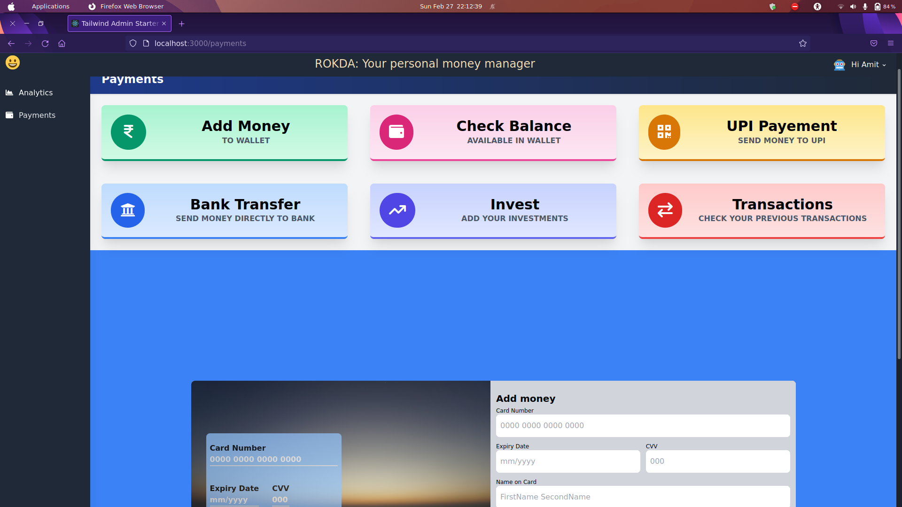
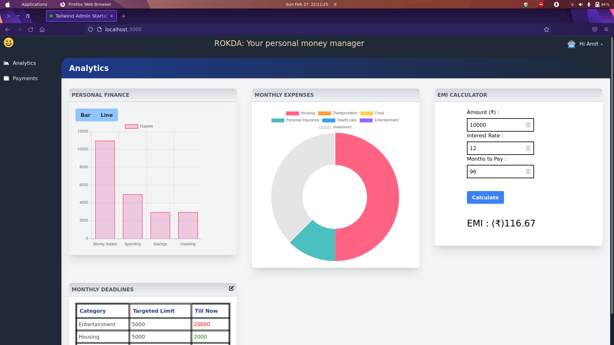
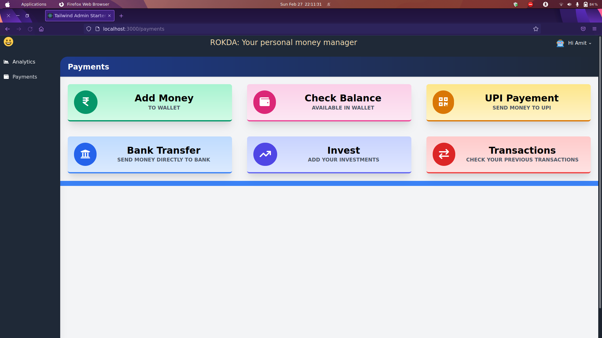

# Rokda
We created an all in one payments gateway which is also an one in all platform for all your investing needs.
We elimate the need of 3 different apps and combine them to one. Now invest in stocks, cryptos and NFTs all in one platform. 

The app is designed to make people aware on the right way to pay EMIs and save money. Generally people don't give much thought to how to pay there EMIs to maximise there profits in long-term.

The app keeps track of your payment history to help you be more accountable about your personal finance. One can also set limits on the amount of money spent on differnt categories such as lesiure, food etc.

***

# Screenshots of some pages and features

---

---

---

---

---

***

# Future Plans

1. Incorporating Gmail API for fast and secure sign-in.
2. Improving the functionality and features of EMI calculator.
3. Create a local wallet/card to avoid using bank for all transitions as an aspect of revenue generation.
4. Including more features for more accountability in personal finance.
   

***

# Working
1. First `git clone` the project
2. `npm install` 
3. `npm run start`
4. Go to `localhost:3000`

